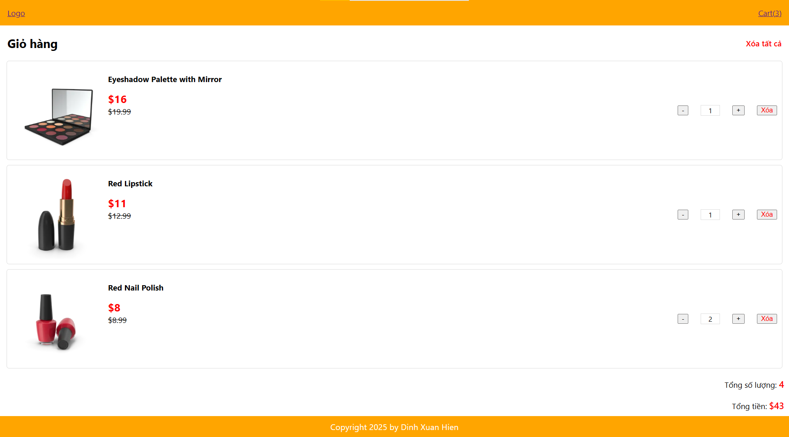

# Shopping-Online React web app

- This is a simple React web app, where I practice React-redux
- This web app shows Products & a Cart to view picked products
- This web app also have some basic features: 
  + Add products
  + Delete 1 product/all products
  + Increase/Decrease quantity of products

## User Interface (UI)
1. Shopping list:

-----------------------------
2. Cart list:

## Getting starterd
After clone this repository, you can start this project by following steps:
1. Install dependencies:
  + `cd practice-redux` (if you’re not in the project directory)
  + `npm install`
2. Run this React project (at another new terminal):
  + `cd practice-redux` (if you’re not in the project directory)
  + `npm start`

## Video demo
Open [this video](https://www.youtube.com/watch?v=PfJj9m2ypmU) to view demo of this repository.

